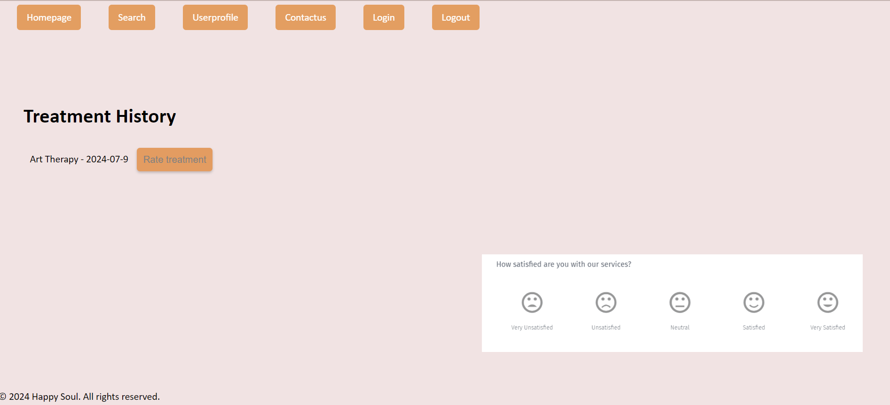
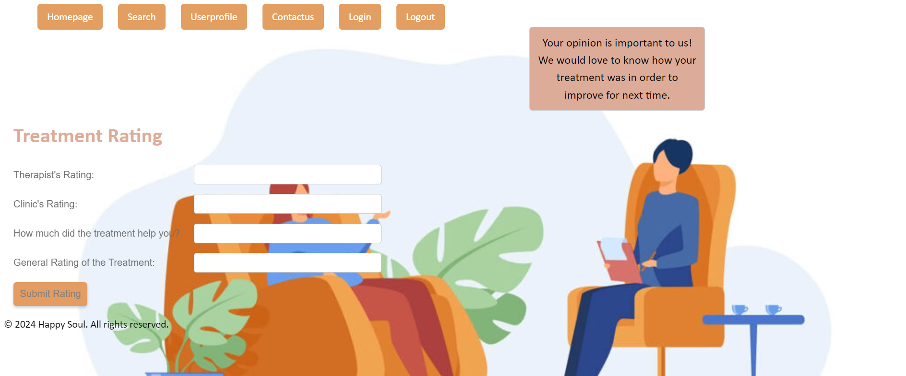
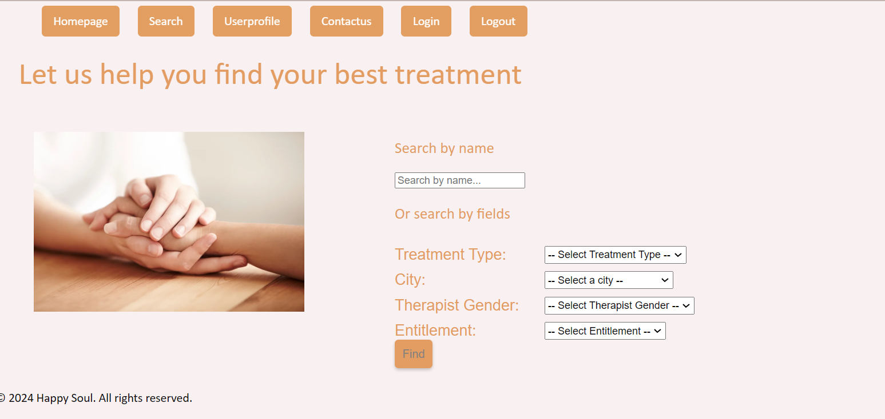
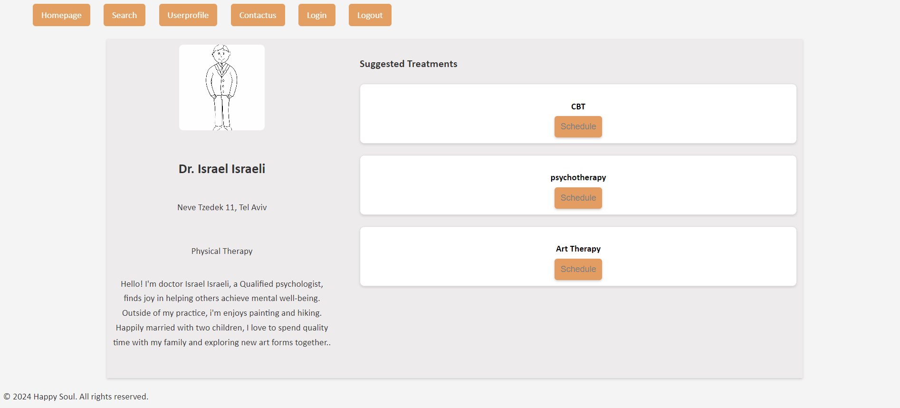
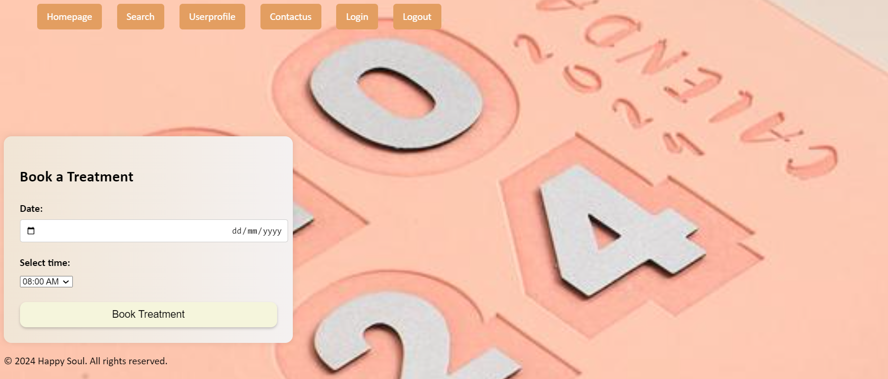
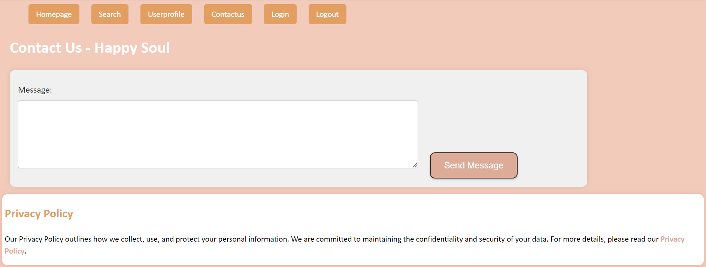
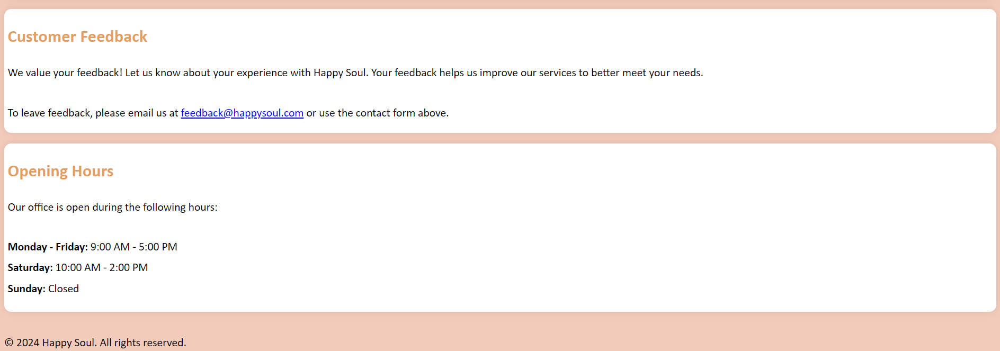

# group20v2
##  323108621, 209307115
### Part C
#### A brief explanation of our website Happy Soul:
Our website allows the user to schedule mental and physical treatments according to his needs and desires, and to be monitored after the treatments he performed. The site allows the user to rate the treatments that have taken place in the past and search for additional treatments that are relevant to him.

#### Actions:
After the user registers and connects to the site, he can perform several different actions:
- The user can make an appointment with a therapist, the sequence is:
1. The user fills in his preferences for handling the search page.
2. The site filters the results for the user, and displays the relevant therapists.
3. The user chooses a therapist and treatment and submits a request for an appointment at the desired time.
- The user can view his personal profile - can view received messages, a list of future treatments and access his treatment history page.
- The user can rate treatments that took place according to several categories.
- The user can send a request to the site team.
The project is organized in a structured folder hierarchy. The structure includes separate folders for java, html, css and python files for each page.

The site connects to a MONGO database (has functions in the MONGODB.PY file). The functions perform all the validations in the DB according to the user input.

Customer routing requests:
The application includes functions to handle requests coming from the client. When a user registers on the site, if he does not yet exist in the system, his personal information is saved in the site's database. Every prescribed treatment, request sent, details of therapists and messages received are also saved in the database and the user can view these details at any given moment. 

The HTML pages of the application were converted to templates as learned in class by blocks. In addition, on the relevant pages (for example userProfile.html), functions were written in blocks that are relevant for displaying output on the HTML page (functions that use the DB).

#### ScreenShots:

On the home page you can see details about the site and a reference to an article that can help the user choose what is best for him

You can create a new user and connect with it

Login screen for existing users - details can be used: Email: tanams@post.bgu.ac.il password: 123456

In the user's profile you can view personal details, you can go to the page showing the treatment history, future treatments including status and messages received

You can view the treatments that have taken place and add a rating to them

The treatment that took place can be rated according to four categories

You can search for treatments according to relevant filters, at least one filter must be entered

A page that displays the search results according to the filter according to which the search was performed, for example a results page after searching for the name "Israel"

Shows the therapist's details and you can go to the schedule page

You can apply for an appointment by date and time

A page showing the user that his request has been accepted in the system

You can contact the site staff regarding various issues

A page showing the site's privacy policy
